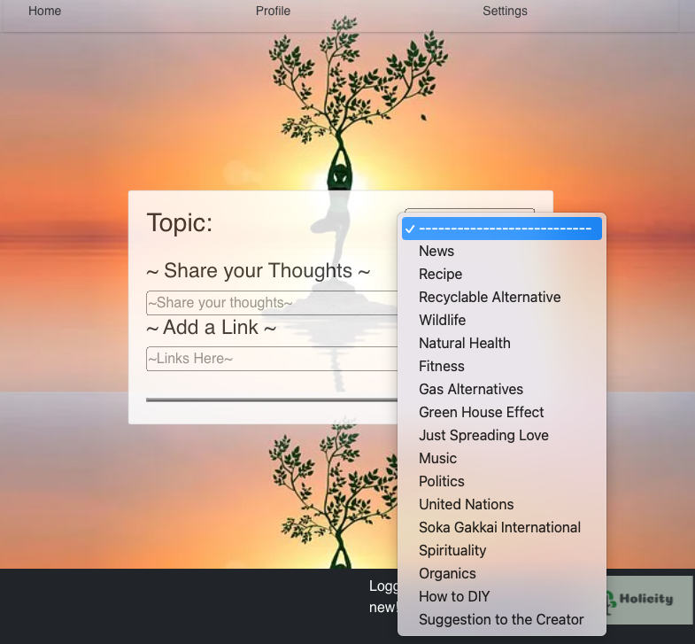

# Holicity
Holicity is a user based platform for social networking to promote a greener earth. Once a User is registered and logged in they are able to create posts, blogs, and comment on others as well as follow and search users. There is also a global news page that updates shows top global news stories, as well as a messenger system comming soon to a theater near you. Getting started is easy just use the nav bar and direct yourself to the getting started page and then the settings page to browse the sites easily accessable pages. The world is yours.. be nice to it...
***
# App OverView: 

***
## ERD: 

***
## CHD:

***
## WireFrame:

***
[Trello](https://trello.com/b/aycojdND/holicity)
***
### Tech Used:
* React
* React-Router-Dom
* React-Bootstrap
* React-Stars
* Axios
* Bootstrap
* Express
* Sequelize
* PostgreSQL
* Heroku
***
## Future Updates:
* I ran into a bunch of issues with the messenger so my first future update will be to get that running properly and figure out how to run that within the site from the same server if possible.
* Also I would like to style the page better because I am definitely not a CSS master
* I have a section of post and blog that allows users to share suggestions about what theyd like to see on the page, as the most loyal customers and supporters may come from people who feel theyve been heard and see theyre ideas implemented in the site they made suggestions too. (Study and Pysch Style: Ryan Holiday -- Growth Hacker Marketing)
***
### Social Links:
[github](https://github.com/Neoj1sec142)   
[linkedIn](https://www.linkedin.com/in/markharmon142/)   
[twitter](https://twitter.com/ManicNeo142)   
[portfolio](neo_portfolio_142.surge.sh)